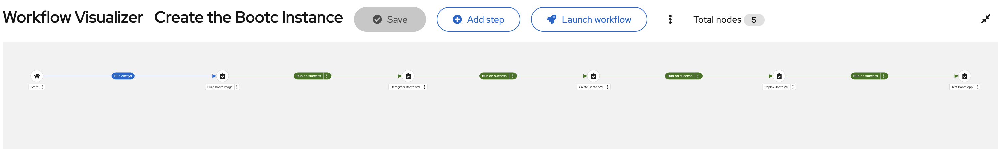

# Installation and usage on AWS

Ensure that you are logged in to your Ansible Automation Controller before proceeding with the following steps.

## Create a project
Go to Automation Execution > Infrastructure.

1. Click `Projects` in the left menu.
2. Click `Add` button.
3. Enter the following fields:
   - Name: `RHEL_Bootc_Demo`
   - Organization: `Default` (or your prefered organization)
   - Source Control Type: `Git`
   - Source Control URL: your git repositoriy
4. Click `Save` button

Please refer to [Ansible Doc](https://docs.redhat.com/en/documentation/red_hat_ansible_automation_platform/2.6/develop-proc_controller_adding_a_project) for more details.

## Create credentials for AWS
At leaset the following two credentails need to be defined. Go to Automation Execution > Infrastructure.

### Credential for AWS
1. Click `Credentials` in the left menu.
2. Click `Create credential` button.
3. Enter the following fields:
   - Name: `aws_cred`
   - Credential Type: `Amazon Web Services`
   - Access Key: your AWS_ACCESS_KEY_ID
   - Secret Key: your AWS_SECRET_ACCESS_KEY
4. Click `Save credential` button.

Please refer to [Ansible Doc](https://docs.redhat.com/en/documentation/red_hat_ansible_automation_platform/2.6/secure-ref_controller_credential_aws) for more details.

### Credential for ssh to AWS instances
1. Click `Credentials` in the left menu.
2. Click `Add credential` button.
3. Enter the following fields:
   - Name: `aws_key`
   - Credential Type: `Machine`
   - SSH Private Key: your AWS private key
4. Click `Save credential` button.

Please refer to [Ansible Doc](https://docs.redhat.com/en/documentation/red_hat_ansible_automation_platform/2.6/secure-con_controller_access_machine_credentials_playbook#ref-controller-credential-machine) for more details.

## Create inventories for AWS
1. Click `Inventories` in the left menu.
2. Click `Create inventory` button and select `Create inventory`.
3. Enter the following fields:
   - Name: `RHEL_Demo`
   - Organization: `Default`
4. Click `Create inventory` button and then select `Sources` tab.
5. Click `Create source` button.
6. Enter the following fields:
   - Name: `AWS`
   - Source: `Amazon EC2`
   - Credential: `aws_cred`
   - Update options: `Overwrite`, `Overwrite variables`, `Update on launch`
   - Source variables:
   ```
   ---
   # Minimal example using environment variables
   # Fetch all hosts taged with "purpose" tag as "demo" in ap-northeast-1
   
   plugin: amazon.aws.aws_ec2
   keyed_groups:
     - prefix: tag
       key: tags

   # Change regions corresponding to your environment
   regions:
     - ap-northeast-1 # adjust with your preference

   # Filter only objects taged with "purpose" tag as "demo"
   filters:
     tag:purpose: demo

   # Ignores 403 errors rather than failing
   strict_permissions: false
   ```
7. Click `Create source` button.
8. Sync inventory source.

Please refer to [Ansible Doc](https://docs.redhat.com/en/documentation/red_hat_ansible_automation_platform/2.6/administer-proc_controller_add_source) for more details.

## Create job templates for AWS
Each job template is equivalent to a playbook in this repository. Repeat these steps for each template/playbook that you want to use and change the variables specific to the individual playbook. Please refer to [Ansible Doc](https://docs.redhat.com/en/documentation/red_hat_ansible_automation_platform/2.6/develop-proc_controller_create_job_template#controller-create-job-template_procedure) for more details.

1. Click `Templates` in the left menu.
2. Click `Create template` button and select `Create job template`.
3. Follow the next steps respectively.
4. Click `Create job template` button

### Build Bootc Image
- Name: `Build Bootc Image`
- Job Type: `Run`
- Inventory: `RHEL_Demo`
- Project:  `RHEL_Bootc_Demo`
- Playbook: `build_image.yml`
- Credentials: `aws_key`
- Survey Varibales: The followings should be configured and passed via survey. Please note that the survey needs to be disabled when running the job within the worflow jobs described later.
    ```
    ---
    bootc_image_name:
    bootc_image_tag:
    bootc_remote_registry:
    bootc_page_title:
    rhsm_username:
    rhsm_passwd:
    registry_username:
    registry_passwd:
    ```

### Create Bootc AMI
- Name: `Create Bootc AMI`
- Job Type: `Run`
- Inventory: `RHEL_Demo`
- Project:  `RHEL_Bootc_Demo`
- Playbook: `create_ami.yml`
- Credentials: `aws_cred` `aws_key`
- Survey Varibales: The followings should be configured and passed via survey. Please note that the survey needs to be disabled when running the job within the worflow jobs described later.
    ```
    ---
    bootc_image_name:
    bootc_image_tag:
    bootc_remote_registry:
    rhsm_username:
    rhsm_passwd:
    registry_username:
    registry_passwd:
    ```

### Deploy Bootc VM
- Name: `Deploy Bootc VM`
- Job Type: `Run`
- Inventory: `RHEL_Demo`
- Project:  `RHEL_Bootc_Demo`
- Playbook: `deploy_vm_aws.yml`
- Credentials: `aws_cred`
- Survey Varibales: The followings should be configured and passed via survey. Please note that the survey needs to be disabled when running the job within the worflow jobs described later.
    ```
    ---
    aws_keypair_name:
    ```

### Test Bootc App
- Name: `Test Bootc App`
- Job Type: `Run`
- Inventory: `RHEL_Demo`
- Project:  `RHEL_Bootc_Demo`
- Playbook: `test_app_aws.yml`
- Credentials: `aws_cred`
- Survey Varibales: The followings should be configured and passed via survey. Please note that the survey needs to be disabled when running the job within the worflow jobs described later.
    ```
    ---
    bootc_page_title:
    ```

### Update Bootc VM
- Name: `Update Bootc VM`
- Job Type: `Run`
- Inventory: `RHEL_Demo`
- Project:  `RHEL_Bootc_Demo`
- Playbook: `update_vm.yml`
- Credentials: `aws_key`
- Extra variables:
    ```
    ---
    target_host: tag_Name_bootc01
    ```
- Survey Varibales: The followings should be configured and passed via survey. Please note that the survey needs to be disabled when running the job within the worflow jobs described later.
    ```
    ---
    bootc_image_name:
    bootc_image_tag:
    bootc_remote_registry:
    ```

### Deregister Bootc AMI
- Name: `Deregister Bootc AMI`
- Job Type: `Run`
- Inventory: `RHEL_Demo`
- Project:  `RHEL_Bootc_Demo`
- Playbook: `deregister_ami.yml`
- Credentials: `aws_cred`

## Create workflow templates
Above job templates are acutually configured as separate workflow templates for initial creation and for updates respectively. Follow the next steps for each environment. Please refer to [Ansible Doc](https://docs.redhat.com/en/documentation/red_hat_ansible_automation_platform/2.6/develop-proc_controller_create_workflow_template#controller-create-workflow-template_about-this-task) for more details.

### Create the Bootc Instance

1. Click `Templates` in the left menu.
2. Click `Create template` button and select `Create workflow job template`.
3. Enter `Create the Bootc Instance` in Name field.
4. Click `Create workflow job template` button.
5. Click `Add step` and launch Visualizer.
6. Configure the workflow template as follows:


7. Click `Save` button.
8. Click `Survery` tab and click `Create survey question` button.
9. Add the following nine surveys and enable them:
    - Bootc Image Name
        - Type: text
        - Answer variable name: `bootc_image_name`
        - Example: `namespace/rhel9-bootc`
    - Bootc Image Tag
        - Type: text
        - Answer variable name: `bootc_image_tag`
        - Example: `1.0`
    - Bootc Remote Registry
        - Type: text
        - Answer variable name: `bootc_remote_registry`
        - Example: `quay.io`
    - Bootc Page Title
        - Type: text
        - Answer variable name: `bootc_page_title`
        - Example: `bootc-http-v1` # needs to be aligned with the Containerfile 
    - RHSM Username
        - Type: text
        - Answer variable name: `rhsm_username`
        - Example: `name@example.com`
    - RHSM Password
        - Type: password
        - Answer variable name: `rhsm_passwd`
    - Registry Username
        - Type: text
        - Answer variable name: `registry_username`
        - Example: `name@example.com`
    - Registry Password
        - Type: password
        - Answer variable name: `registry_passwd`
    - AWS Keypair Name
        - Type: text
        - Answer variable name: `aws_keypair_name`
        - Example: `keypairXYZ`

NOTE: Although `xxx_passwd` should be encrypted in production, using vault for example, I just use easier way for demo purpose.

### Update the Bootc Instance

1. Click `Templates` in the left menu.
2. Click `Create template` button and select `Create workflow job template`.
3. Enter `Update the Bootc Instance` in Name field.
4. Click `Create workflow job template` button.
5. Click `Add step` and launch Visualizer.
6. Configure the workflow template as follows:


1. Click `Save` button.
2. Click `Survery` tab and click `Create survey question` button.
3. Add the following eight surveys and enable them:
    - Bootc Image Name
        - Type: text
        - Answer variable name: `bootc_image_name`
        - Example: `namespace/rhel9-bootc`
    - Bootc Image Tag
        - Type: text
        - Answer variable name: `bootc_image_tag`
        - Example: `2.0`
    - Bootc Remote Registry
        - Type: text
        - Answer variable name: `bootc_remote_registry`
        - Example: `quay.io`
    - Bootc Page Title
        - Type: text
        - Answer variable name: `bootc_page_title`
        - Example: `bootc-http-v2` # needs to be aligned with the Containerfile
    - RHSM Username
        - Type: text
        - Answer variable name: `rhsm_username`
        - Example: `name@example.com`
    - RHSM Password
        - Type: password
        - Answer variable name: `rhsm_passwd`
    - Registry Username
        - Type: text
        - Answer variable name: `registry_username`
        - Example: `name@example.com`
    - Registry Password
        - Type: password
        - Answer variable name: `registry_passwd`

NOTE: Before running the workflow for update, **your image repository needs to be marked as public**.
