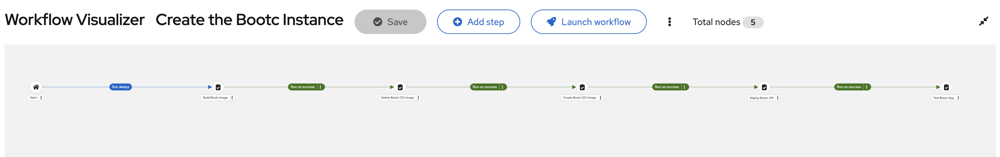
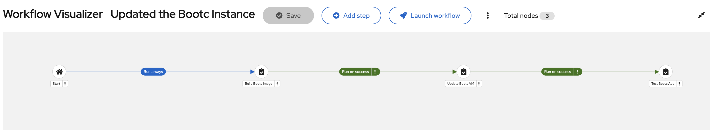

# Execution environment
## Prepare a container image
This demo requires creating a custom execution environment (container image). You can build your container image by using [ansible-builder](https://docs.redhat.com/en/documentation/red_hat_ansible_automation_platform/2.6/install-proc_installing_builder).

First, prepare an ansible-builder installed environment. The easiest way here is using the AAP VM for this purpose. Then, you can build the image using [execution-environment.yml](./ee-oci/execution-environment.yml).
```
$ mkdir $HOME/ee-oci
$ cd $HOME/ee-oci/
$ cp execution-environment.yml $HOME/ee-oci/

$ ansible-builder build -t ee-oci-rhel9
```


After building the container image, you need to push the image to the deployed Automation Hub or any container registry (like quay.io).
```
$ podman login your-automation-hub-address

$ podman image tag ee-oci-rhel9 your-automation-hub-address/ee-oci-rhel9:latest
$ podman push --tls-verify=false your-automation-hub-address/ee-oci-rhel9:latest
```
You can determine your Automation Hub address through the following steps:

1. Log in to your Ansible Automation Platform.
2. Go to Automation Content > Execution Environment.
3. Click `Push container images` button.
4. Copy `podman login ...` command line.

Once you push the container image to your Automation Hub, you would find the container image in the Execution Environment page.

## Set up the execution environment
Once the execution environment gets available in your Automation Hub or your container registry, next you need to make it usable in your Automation Controller.

1. Go to Automation Execution > Execution Environment.
2. Click `Create execution environment` button.
3. Enter the following fields:
   - Name: `OCI execution environment`
   - Image: `your-automation-hub-address/ee-oci-rhel9:latest`
   - Pull: `Only pull the image...`
   - Organization: `Default`
4. Click `Create execution environment` button.

Now, the `OCI execution environment` gets ready.


# Installation and usage on OCI
Ensure that you are logged in to your Ansible Automation Controller before proceeding with the following steps.

## Create a project
Go to Automation Execution > Infrastructure.

1. Click `Projects` in the left menu.
2. Click `Add` button.
3. Enter the following fields:
   - Name: `RHEL_Bootc_Demo`
   - Organization: `Default` (or your prefered organization)
   - Source Control Type: `Git`
   - Source Control URL: your git repositoriy
4. Click `Save` button

Please refer to [Ansible Doc](https://docs.redhat.com/en/documentation/red_hat_ansible_automation_platform/2.6/develop-proc_controller_adding_a_project) for more details.

## Create a custom credential type for OCI
The following custom credential types need to be defined. Go to Automation Execution > Infrastructure.

### Credential type for OCI
1. Click `Credential Types` in the left menu.
2. Click `Create credential type` button.
3. Enter the following fields:
   - Name: `OCI credential`
   - Input configuration:
   ```
   fields:
     - id: oci_tenancy_ocid
       type: string
       label: Tenancy OCID
     - id: oci_user_ocid
       type: string
       label: User OCID
     - id: oci_fingerprint
       type: string
       label: API Key Fingerprint
     - id: oci_private_key_content
       type: string
       label: API Private Key
       secret: true
       multiline: true
     - id: oci_compartment_id
       type: string
       label: Compartment OCID
     - id: oci_object_storage_namespace
       type: string
       label: Object Storage Namespace
     - id: oci_region
       type: string
       label: Region
   required:
     - oci_tenancy_ocid
     - oci_user_ocid
     - oci_fingerprint
     - oci_private_key_content
     - oci_compartment_id
     - oci_object_storage_namespace
     - oci_region
   ```
   - Injector configuration:
   ```
   file:
     template: |
         {{ oci_private_key_content }}
   env:
     OCI_USER: '{{ oci_user_ocid }}'
     OCI_REGION: '{{ oci_region }}'
     OCI_TENANCY: '{{ oci_tenancy_ocid }}'
     OCI_FINGERPRINT: '{{ oci_fingerprint }}'
     OCI_COMPARTMENT_ID: '{{ oci_compartment_id }}'
     OCI_KEY_FILE: '{{ tower.filename }}'
   extra_vars:
     oci_region: '{{ oci_region }}'
     oci_compartment_id: '{{ oci_compartment_id }}'
     oci_object_storage_namespace: '{{oci_object_storage_namespace }}'
   ```
4. Click `Save credential type` button.

### Credential type for SSH Public Key
1. Click `Credential Types` in the left menu.
2. Click `Create credential type` button.
3. Enter the following fields:
   - Name: `OCI SSH Public Key`
   - Input configuration:
   ```
   fields:
     - id: oci_ssh_public_key
       type: string
       label: OCI SSH Public Key
       multiline: true
   required:
     - oci_ssh_public_key
   ```
   - Injector configuration:
   ```
   extra_vars:
     oci_ssh_public_key: '{{ oci_ssh_public_key }}'
   ```
4. Click `Save credential type` button.

Please refer to [Ansible Doc](https://docs.redhat.com/en/documentation/red_hat_ansible_automation_platform/2.6/secure-assembly_controller_custom_credentials) for more details.

## Create credentials for OCI
At leaset the following three credentails need to be defined. Go to Automation Execution > Infrastructure.

### Credential for OCI
1. Click `Credentials` in the left menu.
2. Click `Create credential` button.
3. Enter the following fields:
   - Name: `oci_cred`
   - Organization: Default
   - Credential Type: `OCI credential`
   - Tenancy OCID: OCID of your tenancy
   - User OCID: OCID of the calling user
   - API Key Fingerprint: Key pair fingerprint
   - API Private Key: contents of your PEM private key
   - Compartment OCID: OCID of your compartment
   - Object Storage Namespace: result of `oci os ns get`
   - Region:
4. Click `Save credential` button.

### Credential for ssh to OCI instances
1. Click `Credentials` in the left menu.
2. Click `Create credential` button.
3. Enter the following fields:
   - Name: `oci_private_key`
   - Credential Type: `Machine`
   - SSH Private Key: your SSH private key for OCI instances
4. Click `Save credential` button.

### Credential for public key to inject in OCI instances
1. Click `Credentials` in the left menu.
2. Click `Create credential` button.
3. Enter the following fields:
   - Name: `oci_public_key`
   - Credential Type: `OCI SSH Public Key`
   - OCI SSH Public Key: your SSH public key for OCI instsances 
4. Click `Save credential` button.

Please refer to [Ansible Doc](https://docs.redhat.com/en/documentation/red_hat_ansible_automation_platform/2.6/secure-assembly_controller_credentials) for more details.

## Create inventories for OCI
1. Click `Inventories` in the left menu.
2. Click `Create inventory` button and select `Create inventory`.
3. Enter the following fields:
   - Name: `RHEL_Demo`
   - Organization: `Default`
4. Click `Create inventory` button and then select `Sources` tab.
5. Click `Create source` button.
6. Enter the following fields:
   - Name: `OCI`
   - Execution environment: `OCI execution environment` # needs to sync inventory source
   - Source: `Source from a project`
   - Credential: `oci_cred`
   - Project: `RHEL_Bootc_Demo`
   - Inventory file: `inventory/oci_inventory`
   - Update options: `Overwrite`, `Overwrite variables`, `Update on launch`
7. Click `Create source` button.
8. Sync inventory source.

Please refer to [Ansible Doc](https://docs.redhat.com/en/documentation/red_hat_ansible_automation_platform/2.6/administer-assembly_controller_inventories) for more details.

## Create job templates for OCI
Each job template is equivalent to a playbook in this repository. Repeat these steps for each template/playbook that you want to use and change the variables specific to the individual playbook. Please refer to [Ansible Doc](https://docs.redhat.com/en/documentation/red_hat_ansible_automation_platform/2.6/develop-proc_controller_create_job_template#controller-create-job-template_procedure) for more details.

1. Click `Templates` in the left menu.
2. Click `Create template` button and select `Create job template`.
3. Follow the next steps respectively.
4. Click `Create job template` button

### Build Bootc Image
- Name: `Build Bootc Image`
- Job Type: `Run`
- Inventory: `RHEL_Demo`
- Project:  `RHEL_Bootc_Demo`
- Playbook: `build_image.yml`
- Execution environment: `Default execution environment`
- Credentials: `oci_private_key`
- Survey Varibales: The followings should be configured and passed via survey. Please note that the survey needs to be disabled when running the job within the worflow jobs described later.
    ```
    ---
    bootc_image_name:
    bootc_image_tag:
    bootc_remote_registry:
    bootc_page_title:
    rhsm_username:
    rhsm_passwd:
    registry_username:
    registry_passwd:
    ```

### Create Bootc OCI Image
- Name: `Create Bootc OCI Image`
- Job Type: `Run`
- Inventory: `RHEL_Demo`
- Project:  `RHEL_Bootc_Demo`
- Playbook: `create_custom_image.yml`
- Execution environment: `OCI execution environment`
- Credentials: `oci_cred` `oci_private_key`
- Survey Varibales: The followings should be configured and passed via survey. Please note that the survey needs to be disabled when running the job within the worflow jobs described later.
    ```
    ---
    bootc_image_name:
    bootc_image_tag:
    bootc_remote_registry:
    rhsm_username:
    rhsm_passwd:
    registry_username:
    registry_passwd:
    ```

### Deploy Bootc VM
- Name: `Deploy Bootc VM`
- Job Type: `Run`
- Inventory: `RHEL_Demo`
- Project:  `RHEL_Bootc_Demo`
- Playbook: `deploy_vm_oci.yml`
- Execution environment: `OCI execution environment`
- Credentials: `oci_cred` `oci_public_key`


### Test Bootc App
- Name: `Test Bootc App`
- Job Type: `Run`
- Inventory: `RHEL_Demo`
- Project:  `RHEL_Bootc_Demo`
- Playbook: `test_app_oci.yml`
- Execution environment: `OCI execution environment`
- Credentials: `oci_cred`
- Survey Varibales: The followings should be configured and passed via survey. Please note that the survey needs to be disabled when running the job within the worflow jobs described later.
    ```
    ---
    bootc_page_title:
    ```

### Update Bootc VM
- Name: `Update Bootc VM`
- Job Type: `Run`
- Inventory: `RHEL_Demo`
- Project:  `RHEL_Bootc_Demo`
- Playbook: `update_vm.yml`
- Execution environment: `OCI execution environment`
- Credentials: `oci_key` `oci_private_key`
- Variables:
    ```
    ---
    target_host: tag_Name_bootc01
    ```
- Survey Varibales: The followings should be configured and passed via survey. Please note that the survey needs to be disabled when running the job within the worflow jobs described later.
    ```
    ---
    bootc_image_name:
    bootc_image_tag:
    bootc_remote_registry:
    ```

### Delete Bootc OCI Image
- Name: `Delete Bootc OCI Image`
- Job Type: `Run`
- Inventory: `RHEL_Demo`
- Project:  `RHEL_Bootc_Demo`
- Playbook: `delete_custom_image.yml`
- Execution environment: `OCI execution environment`
- Credentials: `oci_cred`

## Create workflow templates
Above job templates are acutually configured as separate workflow templates for initial creation and for updates respectively. Follow the next steps for each environment. Please refer to [Ansible Doc](https://docs.redhat.com/en/documentation/red_hat_ansible_automation_platform/2.6/develop-proc_controller_create_workflow_template#controller-create-workflow-template_about-this-task) for more details.

### Create the Bootc Instance

1. Click `Templates` in the left menu.
2. Click `Create template` button and select `Create workflow job template`.
3. Enter `Create the Bootc Instance` in Name field.
4. Click `Create workflow job template` button.
5. Click `Add step` and launch Visualizer.
6. Configure the workflow template as follows:


7. Click `Save` button.
8. Click `Survery` tab and click `Create survey question` button.
9. Add the following nine surveys and enable them:
    - Bootc Image Name
        - Type: text
        - Answer variable name: `bootc_image_name`
        - Example: `namespace/rhel9-bootc`
    - Bootc Image Tag
        - Type: text
        - Answer variable name: `bootc_image_tag`
        - Example: `1.0`
    - Bootc Remote Registry
        - Type: text
        - Answer variable name: `bootc_remote_registry`
        - Example: `quay.io`
    - Bootc Page Title
        - Type: text
        - Answer variable name: `bootc_page_title`
        - Example: `bootc-http-v1` # needs to be aligned with the Containerfile
    - RHSM Username
        - Type: text
        - Answer variable name: `rhsm_username`
        - Example: `name@example.com`
    - RHSM Password
        - Type: password
        - Answer variable name: `rhsm_passwd`
    - Registry Username
        - Type: text
        - Answer variable name: `registry_username`
        - Example: `name@example.com`
    - Registry Password
        - Type: password
        - Answer variable name: `registry_passwd`

NOTE: Although `xxx_passwd` should be encrypted in production, using vault for example, I just use easier way for demo purpose.

### Update the Bootc Instance

1. Click `Templates` in the left menu.
2. Click `Create template` button and select `Create workflow job template`.
3. Enter `Update the Bootc Instance` in Name field.
4. Click `Create workflow job template` button.
5. Click `Add step` and launch Visualizer.
6. Configure the workflow template as follows:


1. Click `Save` button.
2. Click `Survery` tab and click `Create survey question` button.
3. Add the following eight surveys and enable them:
    - Bootc Image Name
        - Type: text
        - Answer variable name: `bootc_image_name`
        - Example: `namespace/rhel9-bootc`
    - Bootc Image Tag
        - Type: text
        - Answer variable name: `bootc_image_tag`
        - Example: `2.0`
    - Bootc Page Title
        - Type: text
        - Answer variable name: `bootc_page_title`
        - Example: `bootc-http-v2` # needs to be aligned with the Containerfile
    - Bootc Remote Registry
        - Type: text
        - Answer variable name: `bootc_remote_registry`
        - Example: `quay.io`
    - RHSM Username
        - Type: text
        - Answer variable name: `rhsm_username`
        - Example: `name@example.com`
    - RHSM Password
        - Type: password
        - Answer variable name: `rhsm_passwd`
    - Registry Username
        - Type: text
        - Answer variable name: `registry_username`
        - Example: `name@example.com`
    - Registry Password
        - Type: password
        - Answer variable name: `registry_passwd`

NOTE: Before running the workflow for update, **your image repository needs to be marked as public**.
